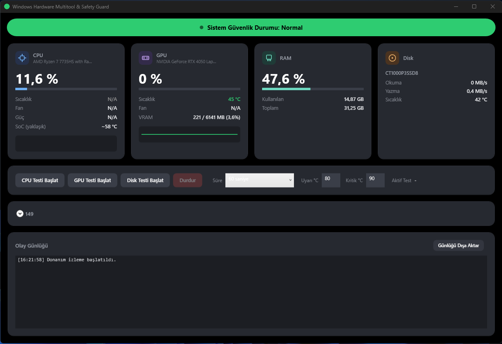

# Windows Hardware Multitool & Safety Guard

Windows için donanım izleme, stres testi ve termal güvenlik katmanına sahip masaüstü aracı. CPU, GPU, RAM ve disk sensörlerini gerçek zamanlı izler; arka planda bağımsız çalışan bir güvenlik katmanı, sıcaklık kritik eşiği aştığı anda çalışan stres testlerini otomatik olarak durdurur.



## Özellikler

- **Donanım izleme** — CPU/GPU kullanım, sıcaklık, fan, güç; RAM kullanımı; disk okuma/yazma hızı ve sıcaklığı. Saniyede bir güncellenir, sıcaklık geçmişi için mini grafikler (sparkline) içerir.
- **Termal güvenlik katmanı** — Yapılandırılabilir uyarı/kritik sıcaklık eşikleri. Kritik eşik aşıldığında çalışan tüm testler anında iptal edilir ve kırmızı bir acil durum uyarısı gösterilir. Uyarı/kritik geçişlerinde sesli uyarı da verir.
- **Stres testi motoru** — CPU (çok çekirdekli matris hesaplama), GPU (render yükü) ve Disk (sıralı okuma/yazma benchmark) için ayrı testler; süreli veya manuel durdurulabilir.
- **Gelişmiş sensör paneli** — Donanım izleme kartlarına yansımayan ham sensör verilerini filtrelenebilir, donanıma göre gruplanmış bir liste halinde gösterir.
- **Sistem tepsisi entegrasyonu** — Pencere küçültüldüğünde sistem tepsisinde çalışmaya devam eder; simge güvenlik durumuna göre renk değiştirir.
- **Kalıcı ayarlar** — Eşik değerleri, test süresi tercihi ve pencere boyutu/konumu bir sonraki açılışta hatırlanır.
- **Günlük dışa aktarma** — Olay günlüğünü metin dosyası olarak kaydedebilirsiniz.

## İndirme

En son sürümü [Releases](../../releases/latest) sayfasından indirebilirsiniz. `.NET` kurulumu gerekmez — tek başına çalışan bir `.exe` dosyasıdır.

## Gereksinimler

- Windows 10/11 (64 bit)
- **Yönetici yetkisi** — donanım sensörlerine sürücü seviyesinde erişim için gereklidir. Uygulama başlatılırken UAC onayı isteyecektir.

## Kaynaktan derleme

```bash
git clone https://github.com/emiralcode/WinHardwareMultitool.git
cd WinHardwareMultitool
dotnet build
```

Gereksinim: [.NET 8 SDK](https://dotnet.microsoft.com/download/dotnet/8.0)

## Notlar

- Sensör verileri [LibreHardwareMonitorLib](https://github.com/LibreHardwareMonitor/LibreHardwareMonitor) ile okunur. Bazı yeni nesil işlemci/APU modellerinde (ör. bazı AMD mobil çipler) kütüphanenin sürücü seviyesi desteği henüz tam olmayabilir; bu durumda ilgili sensör "N/A" olarak gösterilir.
- GPU stres testi, WPF'in donanım hızlandırmalı render motorunu kullanan hafif bir yük testidir; özel bir compute-shader tabanlı stres testi değildir.

## Lisans

MIT
